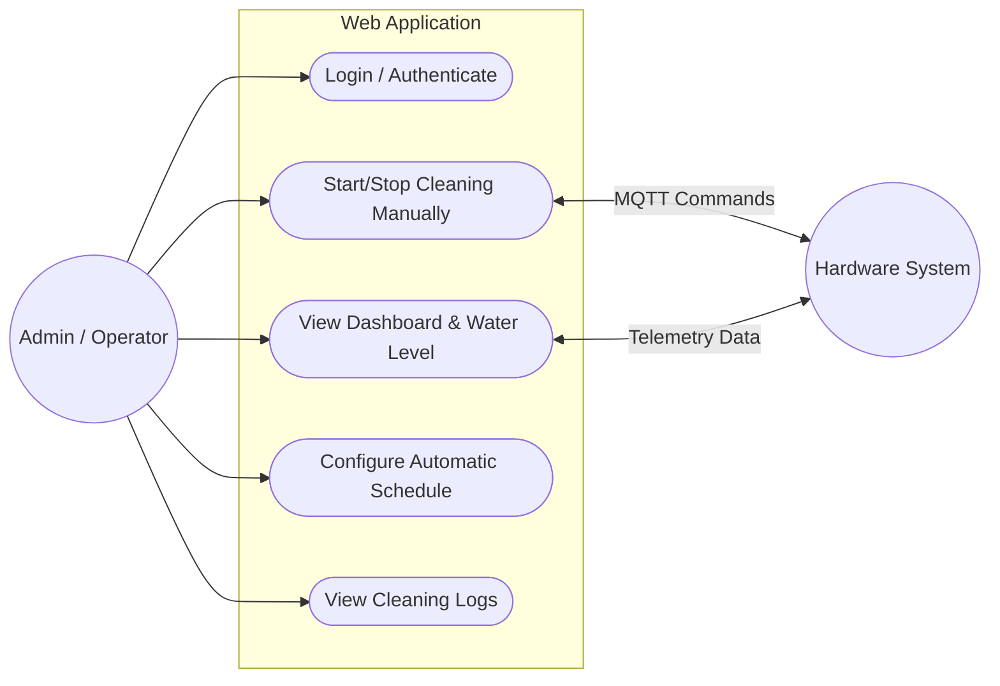
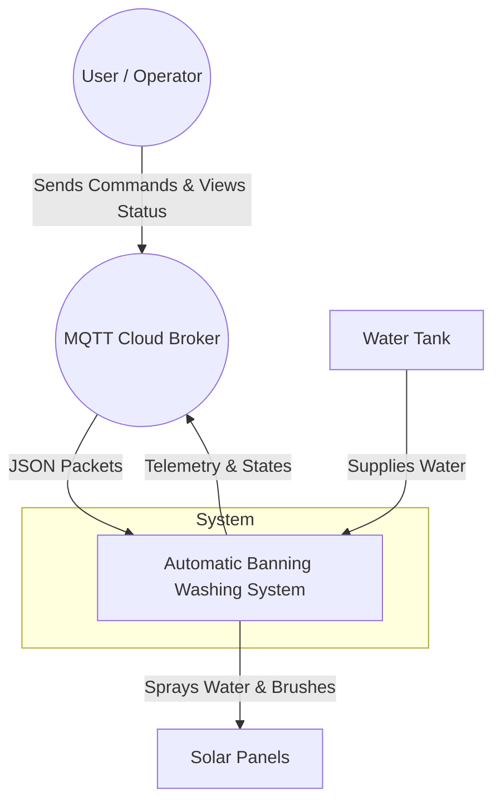
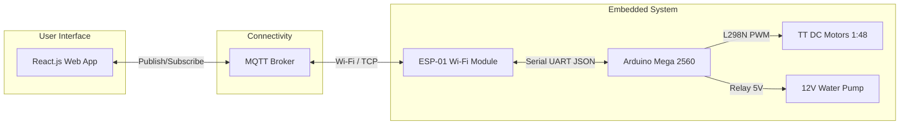
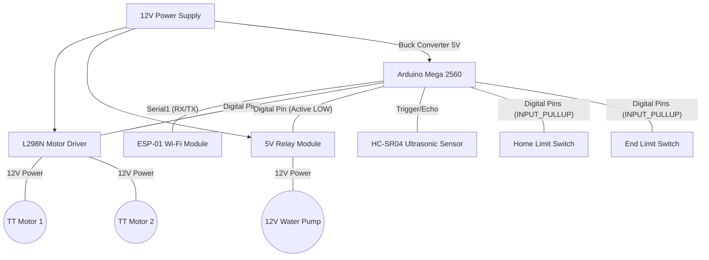
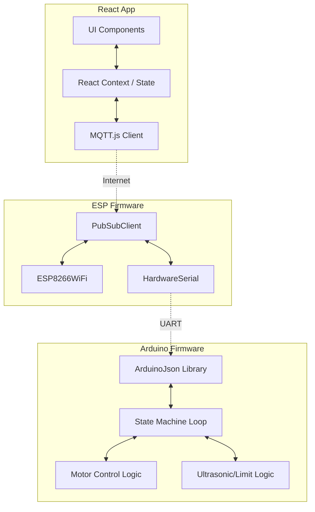
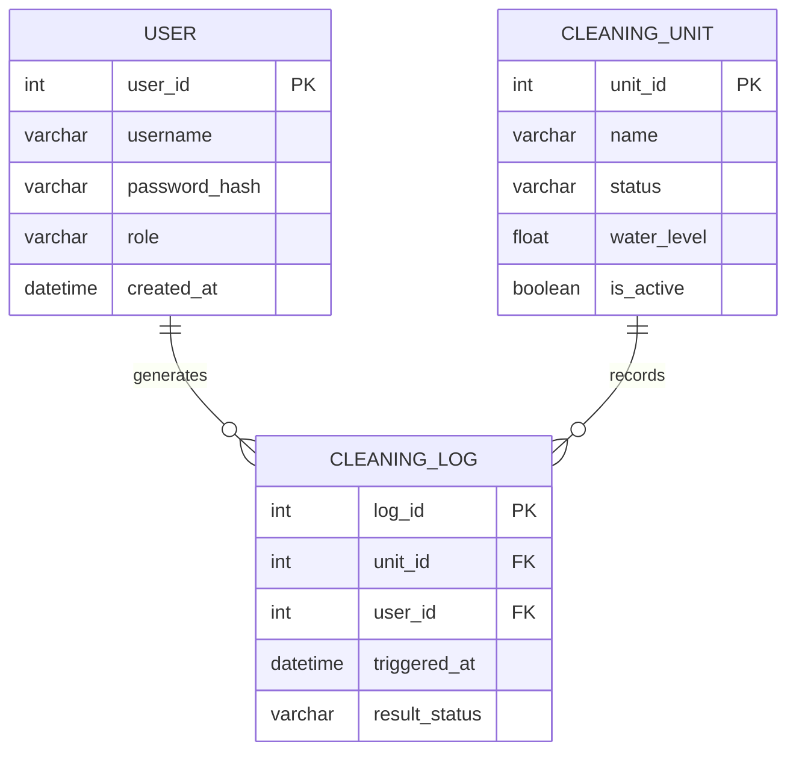
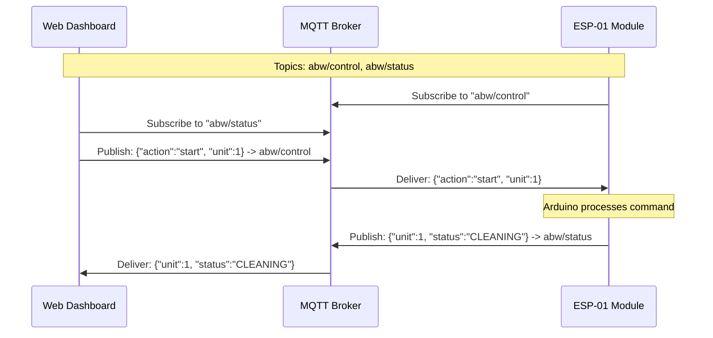
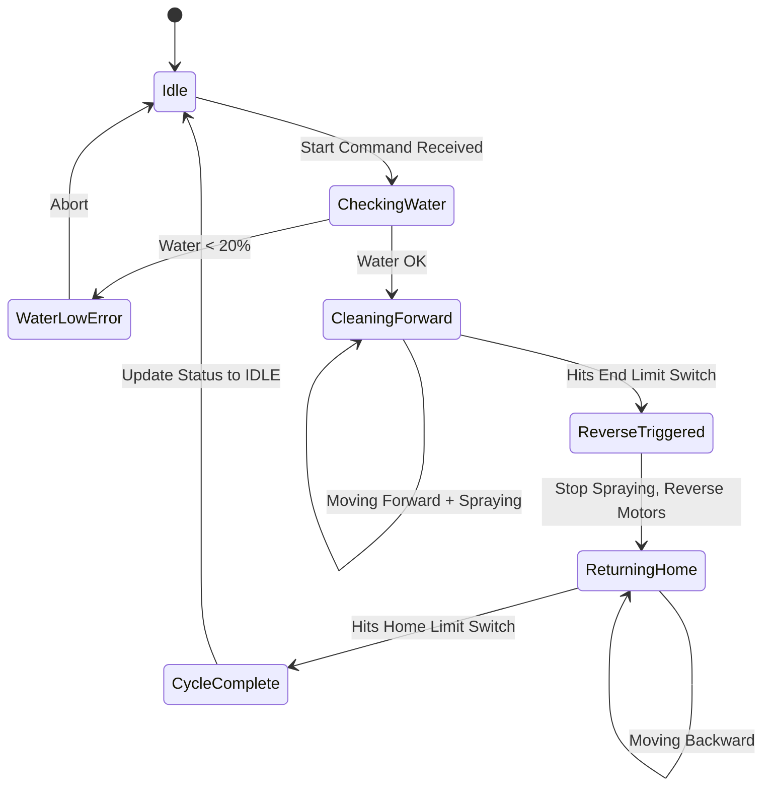
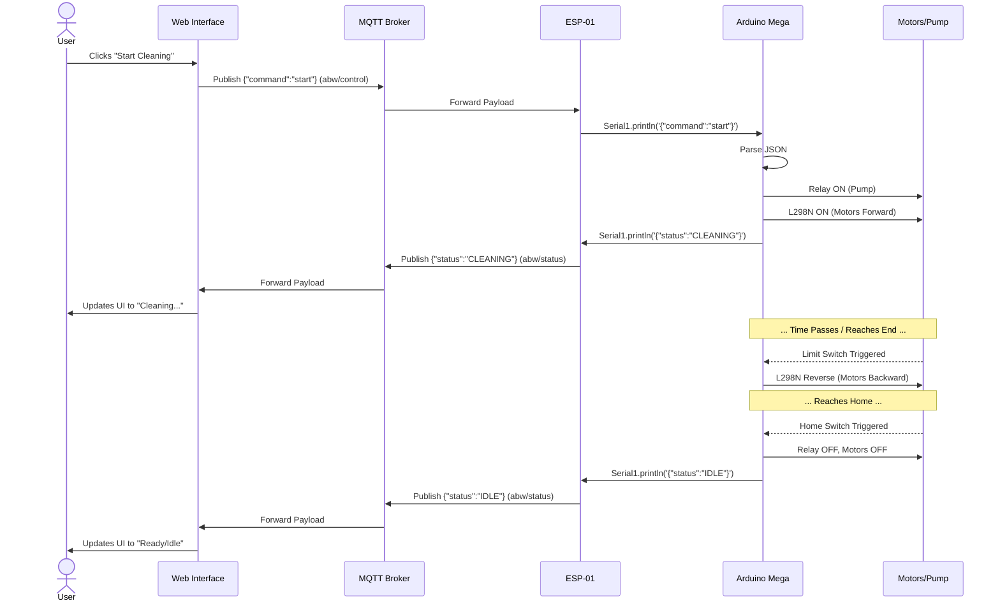

# Automatic Banning Washing System - Technical Diagrams

This document contains all the necessary diagrams for the project report. You can view them directly here, or copy the Mermaid code blocks into tools like [Mermaid Live Editor](https://mermaid.live/) or directly into markdown-supported platforms to generate high-resolution images for your Word document.

---

## 1. Use Case Diagram
*Represents the interactions between the users (Admin/Operator) and the system.*

---

## 2. Context Diagram
*Shows the system as a whole interacting with external entities (Level 0 DFD).*

---

## 3. System Architecture Diagram
*High-level overview of how the frontend, connectivity, and hardware are linked.*

---

## 4. Hardware Architecture Diagram
*Detailed wiring and hardware components connected to the Arduino.*

---

## 5. Software Architecture Diagram
*Internal software modules and communication logic.*

---

## 6. ER Diagram (Logical) & 7. Database Diagram (Physical)
*These represent the data structures used by the application to store users, units, and logs.*

---

## 8. MQTT Communication Diagram
*Shows the specific topics and payload directions.*

---

## 9. Activity Diagram
*The workflow of a single cleaning cycle.*

---

## 10. Sequence Diagram
*Step-by-step execution timeline from User click to Hardware action.*

