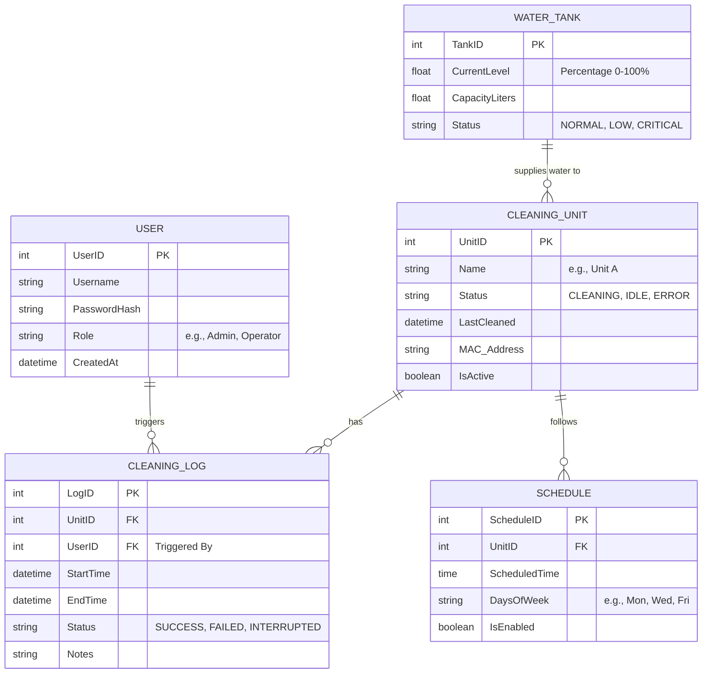

# Entity-Relationship Diagram (ERD)

This diagram outlines the database structure and logical entities for the Automatic Banning Washing System (Solar Panel Cleaner).

### Entities Description:
1. **USER**: Stores credentials and roles for logging into the web dashboard.
2. **CLEANING_UNIT**: Represents each independent cleaning mechanism (the hardware units controlled by Arduino/ESP).
3. **WATER_TANK**: Represents the central water tank monitoring (using the Ultrasonic sensor).
4. **CLEANING_LOG**: Records the history of every cleaning operation, whether successful or failed, and who started it.
5. **SCHEDULE**: Stores automated cleaning schedules for the units.
